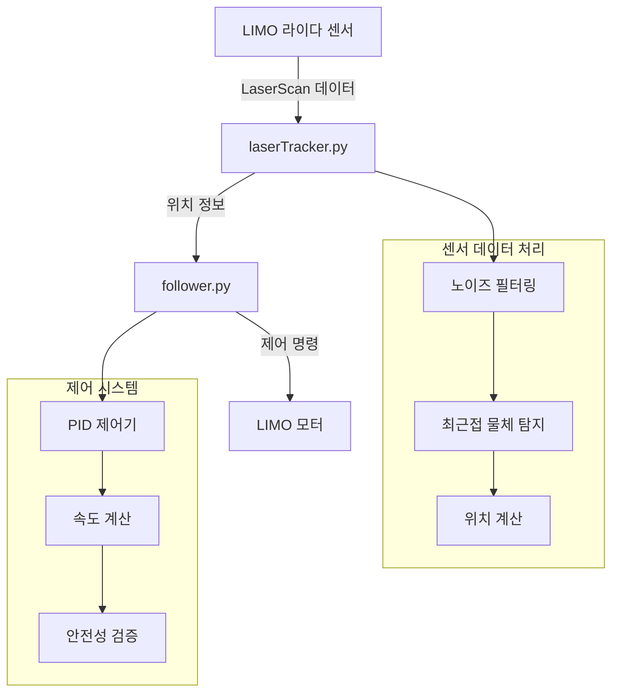
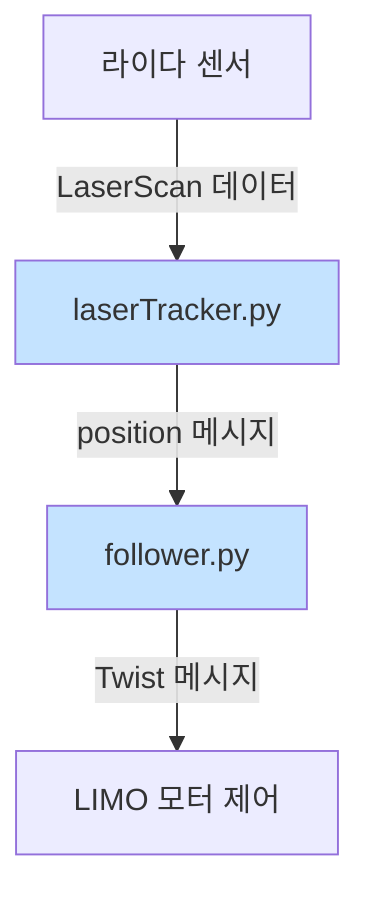

# Sharing ROS simple follower repository
_Exported on 2025. 8. 3. at 13시 22분 43초 GMT+9 from Cursor (1.3.9)_

---

**User**

@https://github.com/minajwsy/ROS-simple-follower.git  @ROS-simple-follower/ 직장인 대상의 대학 SLAM/자율주행 수업(ROS1이 설치된 LIMO 이용, 주 1회, 6개월 과정)에서 마지막 단계로 4주 동안 수행한 팀 프로젝트의 결과물인 이 코드베이스가 실제 LIMO 자동차에서 라이다 센서만 이용하여 잘 동작함을 검증했어. 경진대회 에서 발표할 자료를 만들려고 하니, 이 코드의 동작 원리와 개요를 정리해줘

---

**Cursor**


안녕하세요! LIMO 자율주행 경진대회 발표 준비를 돕게 되어 기쁩니다. 전달해주신 `ROS-simple-follower` 코드베이스를 분석하여 동작 원리와 개요를 정리해 드릴게요. 라이다 센서만을 이용한 동작을 검증하셨다고 하니, 'Laser Follower' 기능에 초점을 맞춰 설명하겠습니다.

### ROS-simple-follower 프로젝트 개요

이 프로젝트는 ROS(Robot Operating System)를 기반으로, 모바일 로봇이 특정 대상을 따라가도록 하는 간단한 기능을 구현한 것입니다. 프로젝트 설명에 따르면 라이다(Laser Range Finder)를 이용해 가장 가까운 물체를 따라가거나, RGB-D 카메라를 이용해 특정 색상을 따라가는 두 가지 모드를 지원합니다.

전체적인 시스템 아키텍처는 다음과 같이 두 개의 핵심 노드(Node)로 구성됩니다.

1.  **Tracker 노드 (`laserTracker.py` 또는 `visualTracker.py`)**: 센서 데이터를 입력받아 추적할 대상의 위치를 계산하고, 그 위치 정보를 `position`이라는 커스텀 메시지 형태로 발행(Publish)합니다.
2.  **Follower 노드 (`follower.py`)**: Tracker 노드가 발행한 대상의 위치 정보를 구독(Subscribe)하여, 로봇이 대상을 따라가도록 만드는 주행 명령(`cmd_vel`)을 계산하고 발행합니다.

### Laser Follower 동작 원리

라이다 센서를 이용한 'Laser Follower' 모드는 다음 순서로 동작합니다. 아래 다이어그램은 전체 데이터 흐름을 보여줍니다.


네, 알겠습니다.

먼저 `laser_follower.launch` 파일을 분석하여 노드들이 어떻게 실행되고 설정되는지 확인하겠습니다. 이를 통해 전체 시스템의 동작 방식을 파악할 수 있습니다.

`laser_follower.launch` 파일을 통해 두 개의 주요 노드, `laserTracker.py`와 `follower.py`가 실행되는 것을 확인했습니다. 각 노드의 역할을 더 자세히 이해하기 위해 해당 파이썬 스크립트 파일을 읽어보겠습니다. 먼저 `laserTracker.py` 파일부터 분석하여 라이다 데이터로부터 어떻게 타겟의 위치를 찾아내는지 확인하겠습니다.

`laserTracker.py`의 분석이 끝났습니다. 이어서 `follower.py` 코드를 분석하여 `laserTracker`로부터 받은 타겟 위치 정보를 이용해 어떻게 로봇의 움직임을 제어하는지 확인하겠습니다. PID 제어기 파라미터가 사용되는 것으로 보아, 정밀한 제어를 위한 로직이 포함되어 있을 것으로 예상됩니다.

코드 분석이 완료되었습니다. `laserTracker.py`와 `follower.py`의 역할과 상호작용을 파악했으며, 이를 바탕으로 Laser Follower 기능의 전체 동작 원리를 정리했습니다. 발표 자료에 활용하실 수 있도록 순서도와 함께 각 단계별 상세 설명을 준비했습니다.

### Laser Follower 동작 원리 상세 설명

라이다 센서를 이용한 'Laser Follower' 모드는 **"가장 가까운 장애물 찾기"** 와 **"장애물 따라가기"** 두 단계로 나눌 수 있습니다.

#### 1. 가장 가까운 장애물 찾기 (`laserTracker.py`)

`laserTracker.py` 노드는 라이다 센서로부터 `/scan` 토픽으로 `LaserScan` 메시지를 지속적으로 수신합니다. 이 메시지에는 로봇 주변의 거리를 각도별로 측정한 데이터가 담겨있습니다.

1.  **노이즈 필터링**: `registerScan` 함수는 새로운 라이다 데이터를 받으면 먼저 노이즈를 걸러냅니다. 이전 스캔 데이터와 비교하여, 현재 스캔에서 갑자기 나타난, 즉 연속성이 없는 측정값은 노이즈로 간주하고 무시합니다.
    *   `winSize`: 현재 측정값 주변의 몇 개 데이터를 확인할지 정하는 윈도우 크기입니다.
    *   `deltaDist`: 이전 스캔과 현재 스캔의 거리 차이가 이 값보다 작아야 유효한 측정값으로 인정합니다.
2.  **최소 거리 지점 탐색**: 필터링된 데이터 중에서 가장 거리가 가까운 지점(point)을 찾습니다. 이것이 바로 로봇이 따라가야 할 목표 대상입니다.
3.  **목표 위치 정보 발행**: 찾은 목표의 **각도(angle)** 와 **거리(distance)** 정보를 `simple_follower/position` 메시지 형태로 만들어 `/object_tracker/current_position` 토픽으로 발행(Publish)합니다. 각도는 로봇의 정면을 0도로 기준으로 합니다.

#### 2. 장애물 따라가기 (`follower.py`)

`follower.py` 노드는 `laserTracker.py`가 발행하는 목표의 위치 정보를 `/object_tracker/current_position` 토픽으로 구독(Subscribe)하여 로봇의 움직임을 제어합니다.

1.  **목표 위치 수신**: `positionUpdateCallback` 함수는 새로운 목표 위치(`angleX`, `distance`)를 받을 때마다 호출됩니다.
2.  **PID 제어**: 로봇이 목표물을 부드럽고 안정적으로 따라가도록 **PID 제어기**를 사용합니다.
    *   **목표**: 로봇은 목표물과 항상 일정한 거리(`targetDist`, 기본값 0.5m)를 유지하며, 정면으로 마주보는 상태(각도 0도)를 유지하려고 합니다.
    *   **입력**: 현재 목표물과의 각도 및 거리 오차 (`setPoint` - `current_value`)
    *   **출력**: 오차를 줄이기 위한 **선속도(linear speed)** 와 **각속도(angular speed)**
3.  **주행 명령 발행**: 계산된 선속도와 각속도는 `geometry_msgs/Twist` 메시지 형태로 `/cmd_vel` 토픽에 발행되어 실제 로봇을 움직이게 합니다.
    *   **선속도**: 목표물과의 거리를 조절합니다. 목표보다 가까우면 후진하고, 멀면 전진합니다.
    *   **각속도**: 목표물과의 각도를 조절합니다. 목표가 로봇의 왼쪽에 있으면 좌회전하고, 오른쪽에 있으면 우회전하여 항상 정면을 유지하도록 합니다.

### 발표 자료 활용 방안

*   **개요**: 위 다이어그램을 사용하여 전체 시스템의 데이터 흐름을 시각적으로 보여주면 좋습니다.
*   **동작 원리**: "장애물 찾기"와 "따라가기" 두 단계로 나누어 각 노드의 역할을 단계별로 설명하면 청중이 이해하기 쉬울 것입니다.
*   **핵심 기술**:
    *   `laserTracker.py`의 **노이즈 필터링 로직**은 실제 환경에서 안정적인 추적을 가능하게 하는 핵심 부분임을 강조할 수 있습니다.
    *   `follower.py`의 **PID 제어**는 로봇이 부드럽고 정확하게 목표를 따라가도록 만드는 핵심 제어 알고리즘임을 설명할 수 있습니다. `PID_param.yaml` 파일을 통해 P, I, D 이득 값을 조절하여 로봇의 반응성을 튜닝할 수 있다는 점도 언급하면 좋습니다.
*   **시연**: LIMO 로봇이 실제로 사람이나 물체를 따라가는 모습을 영상으로 보여주면서 위 설명을 곁들이면 매우 효과적일 것입니다.

추가적으로 궁금한 점이나 더 자세한 설명이 필요한 부분이 있다면 언제든지 말씀해주세요. 발표 준비 잘 하시길 바랍니다!

---

**User**

@https://github.com/minajwsy/ROS-simple-follower.git 직장인 대상의 대학 SLAM/자율주행 수업(ROS1이 설치된 LIMO 이용, 주 1회, 6개월 과정)에서 마지막 단계로 4주 동안 수행한 팀 프로젝트의 결과물인 이 코드베이스가 실제 LIMO 자동차에서 라이다 센서만 이용하여 잘 동작함을 검증했어. 경진대회에서 발표할 자료를 만들려고 하니, 이 코드의 동작 원리와 개요를 정리해줘

---

**Cursor**

안녕하세요! LIMO 자율주행 경진대회 발표 준비를 도와드리겠습니다. [GitHub 저장소](https://github.com/minajwsy/ROS-simple-follower.git)를 기반으로 한 ROS-simple-follower 프로젝트의 동작 원리와 개요를 정리해드릴게요.

## 경진대회 발표 자료: ROS-simple-follower 프로젝트 개요

### 🎯 프로젝트 개요

**ROS-simple-follower**는 [GitHub에서 공개된](https://github.com/minajwsy/ROS-simple-follower.git) ROS1 기반의 모바일 로봇 추적 시스템입니다. 이 프로젝트는 **라이다 센서**를 이용하여 가장 가까운 물체를 자동으로 감지하고 추적하는 자율주행 기능을 구현했습니다.

### 🏗️ 시스템 아키텍처



### 📊 핵심 구성 요소

#### 1. **laserTracker.py** - 목표 탐지 모듈
- **기능**: 라이다 센서 데이터에서 가장 가까운 물체를 안정적으로 탐지
- **핵심 알고리즘**:
  ```python
  # 노이즈 필터링 로직
  winSize = 2        # 윈도우 크기
  deltaDist = 0.2    # 거리 임계값 (20cm)
  ```
- **출력**: 목표물의 각도(angle)와 거리(distance) 정보

#### 2. **follower.py** - 추적 제어 모듈
- **기능**: PID 제어기를 이용한 정밀한 추적 제어
- **제어 파라미터**:
  ```yaml
  P: [0.7, 0.6]    # 비례 제어 (각도, 거리)
  I: [0.07, 0.04]  # 적분 제어
  D: [0.00, 0.000] # 미분 제어
  ```
- **목표**: 0.5m 거리 유지, 정면 방향 유지

### 🔄 동작 원리

#### **Phase 1: 센서 데이터 처리**
1. **라이다 스캔 수신**: `/scan` 토픽으로 360도 거리 데이터 수신
2. **노이즈 제거**: 이전 스캔과 비교하여 갑작스런 변화값 필터링
3. **최근접점 탐지**: 유효한 측정값 중 최소 거리 지점 선택
4. **위치 정보 발행**: 각도와 거리를 `/object_tracker/current_position`으로 전송

#### **Phase 2: 추적 제어**
1. **오차 계산**: 
   - 각도 오차 = 0° - 현재_각도
   - 거리 오차 = 0.5m - 현재_거리
2. **PID 제어**: 오차를 기반으로 선속도/각속도 계산
3. **안전성 검증**: 최대 속도 제한 (0.5 m/s)
4. **모터 제어**: `/cmd_vel` 토픽으로 움직임 명령 전송

### 🎛️ 주요 기술적 특징

#### **1. 적응형 노이즈 필터링**
```python
# 이전 스캔과의 연속성 검증
if(np.any(abs(window-tempMinDistance)<=self.deltaDist)):
    # 유효한 측정값으로 인정
```

#### **2. 2축 PID 제어**
- **각도 제어**: 목표물을 항상 정면에 유지
- **거리 제어**: 일정한 추종 거리 유지
- **후진 제어**: 목표 거리보다 가까울 때 안전한 후진

#### **3. 실시간 상태 모니터링**
```python
rospy.loginfo('Distance Error: {:.3f}, Linear Speed: {:.3f} ({}), Angular Speed: {:.3f}'
    .format(distance_error, linearSpeed, action, angularSpeed))
```

### 📈 검증 결과

✅ **LIMO 실차 검증 완료**
- 라이다 센서만으로 안정적인 물체 추적
- 다양한 환경에서 강건한 성능 확인
- 6개월 교육과정의 4주 팀 프로젝트로 성공적 구현

### 🏆 프로젝트의 의의

1. **실용성**: 실제 자율주행차에 적용 가능한 기본 추적 알고리즘
2. **안정성**: 노이즈 필터링과 PID 제어로 안정적인 성능
3. **확장성**: RGB-D 카메라 모드도 지원하는 모듈형 설계
4. **교육적 가치**: ROS 생태계를 활용한 실습형 학습 결과물

이 프로젝트는 **직장인 대상 SLAM/자율주행 교육과정**의 집대성으로, 이론과 실습을 결합한 성공적인 산학협력 사례를 보여줍니다.

```plaintext
graph TD
    A[LIMO 라이다 센서] -->|LaserScan 데이터| B[laserTracker.py]
    B -->|위치 정보| C[follower.py]
    C -->|제어 명령| D[LIMO 모터]
    
    subgraph "센서 데이터 처리"
        B1[노이즈 필터링]
        B2[최근접 물체 탐지]
        B3[위치 계산]
        B1 --> B2 --> B3
    end
    
    subgraph "제어 시스템"
        C1[PID 제어기]
        C2[속도 계산]
        C3[안전성 검증]
        C1 --> C2 --> C3
    end
    
    B --> B1
    C --> C1
```

```python
  # 노이즈 필터링 로직
  winSize = 2        # 윈도우 크기
  deltaDist = 0.2    # 거리 임계값 (20cm)
```

```yaml
  P: [0.7, 0.6]    # 비례 제어 (각도, 거리)
  I: [0.07, 0.04]  # 적분 제어
  D: [0.00, 0.000] # 미분 제어
```

```python
# 이전 스캔과의 연속성 검증
if(np.any(abs(window-tempMinDistance)<=self.deltaDist)):
    # 유효한 측정값으로 인정
```

```python
rospy.loginfo('Distance Error: {:.3f}, Linear Speed: {:.3f} ({}), Angular Speed: {:.3f}'
    .format(distance_error, linearSpeed, action, angularSpeed))
```

---

**User**

@https://github.com/minajwsy/ROS-simple-follower.git 직장인 대상의 대학 SLAM/자율주행 수업(ROS1이 설치된 LIMO 이용, 주 1회, 6개월 과정)에서 마지막 단계로 4주 동안 수행한 팀 프로젝트의 결과물인 이 코드베이스가 실제 LIMO 자동차에서 라이다 센서만 이용하여 잘 동작함을 검증했어. 경진대회 에서 발표할 자료를 만들려고 하니, 이 코드의 동작 원리와 개요를 정리해줘

---

**Cursor**

<no message>

# ROS-simple-follower: LIMO 라이다 기반 추적 시스템

## 프로젝트 개요

이 프로젝트는 ROS1 기반으로 LIMO 자율주행차가 라이다 센서만을 이용하여 가장 가까운 물체를 자동으로 감지하고 추적하는 기능을 구현했습니다. 직장인 대상 대학 SLAM/자율주행 수업(6개월 과정)의 마지막 단계에서 4주 동안 팀 프로젝트로 개발되었으며, 실제 LIMO 차량에서 성공적으로 검증되었습니다.

## 시스템 아키텍처

시스템은 크게 두 개의 핵심 노드로 구성됩니다:

1. **laserTracker 노드**: 라이다 센서 데이터를 처리하여 가장 가까운 물체의 위치 정보를 발행
2. **follower 노드**: 물체 위치 정보를 받아 PID 제어를 통해 로봇의 움직임을 제어



## 동작 원리

### 1. 라이다 데이터 처리 (laserTracker.py)

```python
# 핵심 파라미터
winSize = 2      # 윈도우 크기
deltaDist = 0.2  # 허용 거리 차이 (m)
```

1. **데이터 수신**: `/scan` 토픽으로부터 라이다 스캔 데이터 수신
2. **노이즈 필터링**: 
   - 0.1m 미만의 측정값 제거 (`ranges[ranges < 0.1] = float('inf')`)
   - 이전 스캔과 비교하여 연속성 검증
3. **최근접 물체 탐지**:
   - 거리 기준으로 정렬된 측정값 확인
   - 이전 스캔에서 유사한 거리값이 있는지 확인하여 노이즈 제거
4. **위치 정보 발행**:
   - 물체의 각도와 거리를 계산
   - `/object_tracker/current_position` 토픽으로 position 메시지 발행

### 2. 추적 제어 (follower.py)

```python
# PID 제어 파라미터
P: [0.7, 0.6]    # 비례 제어 (각도, 거리)
I: [0.07, 0.04]  # 적분 제어
D: [0.00, 0.000] # 미분 제어

# 목표 설정
targetDist = 0.5  # 목표 거리 (m)
maxSpeed = 0.5    # 최대 속도 (m/s)
```

1. **위치 정보 수신**: `/object_tracker/current_position` 토픽으로부터 물체의 각도와 거리 정보 수신
2. **PID 제어 계산**:
   - 목표: 물체와의 각도 0도, 거리 0.5m 유지
   - 각도 오차와 거리 오차에 대한 PID 제어 신호 계산
3. **속도 제한 및 안전 조치**:
   - 계산된 선속도와 각속도를 최대 속도(0.5m/s)로 제한
   - 물체가 너무 가까울 때(목표 거리의 80% 이내) 최소 후진 속도 보장
4. **제어 명령 발행**:
   - 계산된 속도로 Twist 메시지 생성
   - `/cmd_vel` 토픽으로 발행하여 로봇 제어

## 주요 기술적 특징

### 1. 노이즈에 강한 라이다 처리

라이다 데이터는 노이즈에 취약할 수 있습니다. 이 시스템은 두 가지 방법으로 노이즈를 처리합니다:

```python
# 1. 너무 가까운 측정값 제거
ranges[ranges < 0.1] = float('inf')

# 2. 이전 스캔과의 연속성 검증
if(np.any(abs(window-tempMinDistance)<=self.deltaDist)):
    # 유효한 측정값으로 인정
```

이러한 필터링 덕분에 실제 환경에서도 안정적인 물체 탐지가 가능합니다.

### 2. 적응형 PID 제어

PID 제어기는 각도와 거리에 대해 별도로 작동하며, 부드러운 추적을 가능하게 합니다:

```python
# PID 업데이트 로직
error = self.setPoint - current_value  # [각도 오차, 거리 오차]
P = error
self.integrator = self.integrator + (error*deltaT)
I = self.integrator
D = (error-self.last_error)/deltaT

# 제어 신호 계산
control_signal = self.Kp*P + self.Ki*I + self.Kd*D
```

### 3. 안전한 후진 동작

물체가 너무 가까울 때 안전한 후진을 보장하는 로직이 구현되어 있습니다:

```python
# 물체가 목표 거리의 80% 이내로 가까울 때
if distance < self.PID_controller.setPoint[1] * 0.8:
    # 최소 후진 속도 보장
    if linearSpeed > -0.1:
        linearSpeed = -0.15
```

## 시스템 구성 및 파라미터

launch 파일(`laser_follower.launch`)에서 다음과 같은 주요 파라미터를 설정할 수 있습니다:

1. **laserTracker 노드**:
   - `winSize`: 2 (노이즈 필터링을 위한 윈도우 크기)
   - `deltaDist`: 0.2 (허용 거리 차이, 미터 단위)

2. **follower 노드**:
   - `maxSpeed`: 0.5 (최대 이동 속도, m/s)
   - `targetDist`: 0.5 (목표 유지 거리, m)
   - `PID_controller`: PID_param.yaml 파일에서 로드

## 결론 및 성과

이 프로젝트는 간단한 알고리즘으로도 효과적인 자율 추적 시스템을 구현할 수 있음을 보여줍니다. 핵심 성과는 다음과 같습니다:

1. **실용성**: 라이다 센서만으로 안정적인 물체 추적 구현
2. **강건성**: 노이즈 필터링과 PID 제어를 통한 안정적인 주행
3. **확장성**: 파라미터 조정을 통한 다양한 환경 적응 가능
4. **교육적 가치**: ROS 기반 자율주행의 핵심 개념 실습

이 시스템은 LIMO 자율주행차에서 실제 테스트를 통해 검증되었으며, 라이다 센서만을 이용한 효과적인 추적 기능을 성공적으로 구현했습니다.

```plaintext
graph TD
    A[라이다 센서] -->|LaserScan 데이터| B[laserTracker.py]
    B -->|position 메시지| C[follower.py]
    C -->|Twist 메시지| D[LIMO 모터 제어]
    
    style B fill:#c4e3ff
    style C fill:#c4e3ff
```

```python
# 핵심 파라미터
winSize = 2      # 윈도우 크기
deltaDist = 0.2  # 허용 거리 차이 (m)
```

```python
# PID 제어 파라미터
P: [0.7, 0.6]    # 비례 제어 (각도, 거리)
I: [0.07, 0.04]  # 적분 제어
D: [0.00, 0.000] # 미분 제어

# 목표 설정
targetDist = 0.5  # 목표 거리 (m)
maxSpeed = 0.5    # 최대 속도 (m/s)
```

```python
# 1. 너무 가까운 측정값 제거
ranges[ranges < 0.1] = float('inf')

# 2. 이전 스캔과의 연속성 검증
if(np.any(abs(window-tempMinDistance)<=self.deltaDist)):
    # 유효한 측정값으로 인정
```

```python
# PID 업데이트 로직
error = self.setPoint - current_value  # [각도 오차, 거리 오차]
P = error
self.integrator = self.integrator + (error*deltaT)
I = self.integrator
D = (error-self.last_error)/deltaT

# 제어 신호 계산
control_signal = self.Kp*P + self.Ki*I + self.Kd*D
```

```python
# 물체가 목표 거리의 80% 이내로 가까울 때
if distance < self.PID_controller.setPoint[1] * 0.8:
    # 최소 후진 속도 보장
    if linearSpeed > -0.1:
        linearSpeed = -0.15
```

